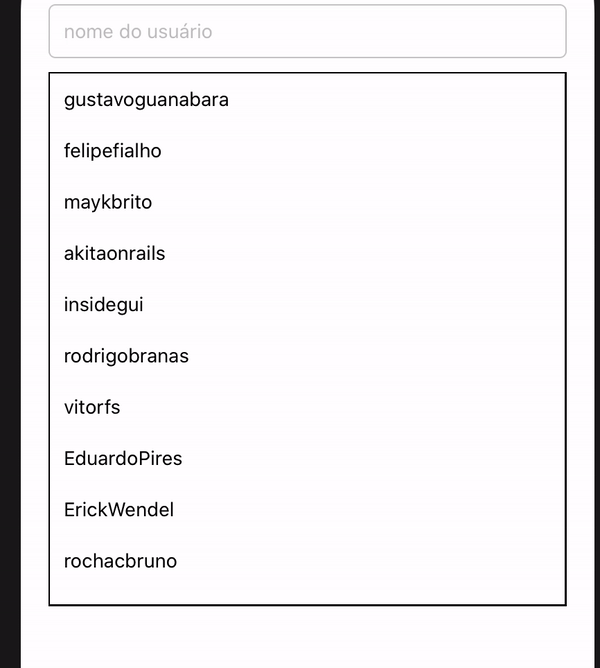

# Text Highlight

o objetivo desse pequeno projeto é mostrar como podemos 'filtrar' uma lista e obter dados visuais mais agradáveis ao usuário fazendo com que ele consiga enxergar quais partes que ele digita que coincidem com elementos da lista.

nesse exemplo está sendo listado usuários do github através do rest:

[`https://api.github.com/search/users?q=location:brazil`](https://api.github.com/search/users?q=location:brazil)



## Transformação

```tsx
import React from 'react';
import {Text} from 'react-native';

const textHighlight = (text, highlight, Wrapper) => {
  const parts = text.split(new RegExp(`(${highlight})`, 'gim'));

  const result = parts.map((part) =>
    part.toLowerCase() === highlight.toLowerCase() ? (
      <Wrapper key={`${Math.random()}-${part}`}>{part}</Wrapper>
    ) : (
      <Text key={`${Math.random()}-${part}`}>{part}</Text>
    ),
  );

  return result;
};

export default textHighlight;
```

é bem simples , primeiro precisamos da frase inteira text, do que ficará 'aceso'  highlight e por fim o container que queremos que fique por voltar dos textos em destaque que eu chamei de wrapper.

ou seja precisamos modificar o dado original pra podermos ter esse efeito.

```jsx
userList.map((user) => ({
            ...user,
            login: TextHighlight(user.login, searchValue, HighlightText),
}));
```

espero que ajude em seus estudos ;).